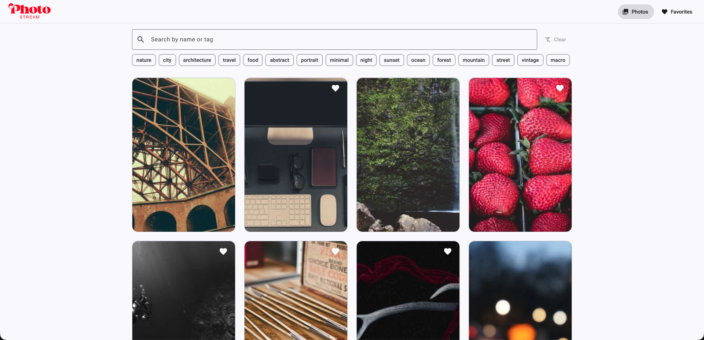
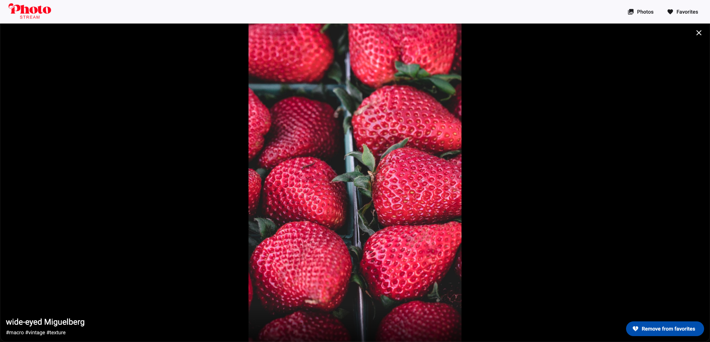

# Photostream

This application was created for a test step for recruitment. Photostream is a photo library built with Angular. In photostream the user can browse an endless stream of random photos, search and filter by title or tag. Additionally, the user can save the photos they like to Favorites. To view the photo closer, the user can open any favorite photo in a full-screen view.





### Features

- **Infinite photo stream** at home page (`/`). Photos are loaded in batches as the user scrolls, with a loading spinner
- The user can **Save to Favorites** by clicking a photo (or the heart icon). Favorites persist across page refreshes (in `localStorage`)
- Separate **Favorites page** (`/favorites`) that lists every saved photo
- **Single photo page** (`/photos/:id`) that shows a full screen image and a "Remove from favorites" button
- **Search and filter** by title or tag randomly assigned to the photo (seeded)
- **Download** a photo from its card
- Responsive layout (2, 3, or 4 columns)

### Tech stack

- Angular v22
- Angular Router v22
- Angular Material v22
- SCSS
- RxJS
- faker-js for photo titles
- Images from Picsum Photos

### Getting started

Requires a current Node.js LTS release.

```bash
npm install
npm start
```

Other scripts:

```bash
npm test
npm run build
```

### Design decisions

- `PhotoService` returns an Observable with a random 200-300ms delay, so the UI handles loading states as it would with a real backend.
- Image URLs use Picsum's seed feature. Same id always shows the same image.
- `FavoritesService` stores whole photos. This means that the Favorites and the detail pages do not need a separate API call.
- `SearchService` holds the search text and the selected tags to keep the search bar, photo cards and both list pages in sync.
- Infinite scroll is a custom directive built on `IntersectionObserver`.

### Project structure

```
src/app/
├── core/
│   ├── models/            # Photo interface
│   ├── services/          # PhotoService, FavoritesService, StorageService, SearchService
│   └── utils/             # title and tag generators, search matching, download helper
├── shared/
│   ├── components/        # header, photo-card, photo-grid, search-bar
│   └── directives/        # infinite-scroll
└── features/              # one folder per routed page
    ├── photos-page/
    ├── favorites-page/
    └── photo-detail-page/
```

### Testing

Unit test files live next to the code they cover (`*.spec.ts`). Run with `npm test`.

### Notes

- There is no backend and no login.
- Favorites are stored in `localStorage`, so they belong to one browser on one device.
- Photo titles and tags are generated from the photo id, they don't necessarily describe the image.
- Search covers the first 500 photos
